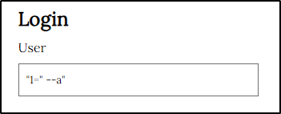

# Informe de pentesting

# **Índice**

- **Declaración de confidencialidad**
- **Descargo de responsabilidad**
- **Información de contacto**
- **Índices de gravedad de los hallazgos**
- **Factores de riesgo**
- **Alcance**
- **Resumen ejecutivo**
- **Informe de vulnerabilidades**
- Conclusiones

## **Declaración de confidencialidad**:

Toda la información contenida en este informe es confidencial y está destinada únicamente para el uso de las partes autorizadas. Cualquier divulgación no autorizada está prohibida y puede estar sujeta a acciones legales.

## **Descargo de responsabilidad**

Este informe se basa en la evaluación realizada por el equipo de pentesting y refleja los hallazgos obtenidos durante ese proceso. El equipo de evaluación no se hace responsable de cualquier interpretación errónea o acción tomada como resultado de la información proporcionada en este informe.

## **Información de contacto**

- Organización Auditada: Talent ScoutTech
- Evaluadores:
    - Nombre: Adrián Campó Merlo
        - Correo Electrónico: **acamer@geduca.es**
        - Teléfono: +34 654789632

## Alcance del análisis

El alcance del pentesting abarca la evaluación de los activos digitales accesibles a través del servidor web. Esto incluye todos los archivos y recursos ubicados en la raíz y en las carpetas web del servidor, http://172.23.25.26:80. Durante el proceso de evaluación, se llevarán a cabo pruebas exhaustivas para identificar vulnerabilidades y riesgos de seguridad en estos activos.

## Índices de gravedad de los hallazgos

La siguiente tabla proporciona una escala para evaluar la gravedad de las vulnerabilidades identificadas.

| Nivel de Criticidad | Puntuaciones | Descripción de la Criticidad |
| --- | --- | --- |
| Bajo | 0.0 - 3.9 | Vulnerabilidades con impacto limitado o que requieren condiciones poco probables para ser explotadas. |
| Medio | 4.0 - 6.9 | Vulnerabilidades con un impacto moderado que pueden ser explotadas bajo ciertas condiciones. |
| Alto | 7.0 - 8.9 | Vulnerabilidades con un impacto significativo y que pueden ser fácilmente explotadas. |
| Crítico | 9.0 - 10.0 | Vulnerabilidades con un impacto devastador y que pueden ser explotadas de manera trivial o sin requerir autenticación. |

## **Factores de riesgo**

La siguiente tabla presenta una clasificación de los hallazgos encontrados durante la evaluación de seguridad, basada en su severidad.

| Hallazgo | Severidad | Descripción |
| --- | --- | --- |
| Inyección SQL | Alta | Permite a un atacante manipular consultas SQL, llevando a la divulgación de datos y corrupción de la BD. |
| Cross-Site Scripting (XSS) | Alta | Explota la falta de filtrado para ejecutar scripts maliciosos, pudiendo robar sesiones de usuario. |
| Deficiencias en autenticación y acceso | Alta | Falta de control y autenticación débil, permitiendo acceso no autorizado y exposición de datos. |
| Exposición de archivos de copia de seguridad | Media | Expone archivos sensibles que pueden contener información confidencial. |

## **Resumen ejecutivo**

La investigación realizada reveló múltiples vulnerabilidades en la aplicación Talent ScoutTech, abarcando áreas como la inyección SQL, el Cross-Site Scripting (XSS) y deficiencias en la autenticación y el control de acceso. Estas debilidades representan una seria amenaza para la integridad y confidencialidad de los datos de la aplicación, así como para la reputación y la seguridad de los usuarios. 

## Informe de vulnerabilidades

Según la [investigación técnica](Informe_tecnico.md) realizada podemos determinar los siguientes hallazgos.

### **Inyección SQL**

| Descripción de la vulnerabilidad | Inyección SQL permite a un atacante manipular consultas SQL |
| --- | --- |
| CVE/CWE | [CWE-89](https://cwe.mitre.org/data/definitions/89.html) |
| CVSS v3 | - |
| Severidad | Alta |
| Impacto | Explotación podría llevar a la divulgación de datos confidenciales y corrupción de la base de datos |
| Sistemas afectados | http://172.23.25.26:80 |
| Remediación | Utilizar consultas preparadas y validación de entrada de datos |
| Link de referencia | https://owasp.org/www-community/attacks/SQL_Injection |
| Prueba de concepto (POC) |  |

### **Cross-Site Scripting (XSS)**

| Descripción de la vulnerabilidad | Explotación de falta de filtrado en la entrada del usuario para ejecutar scripts maliciosos |
| --- | --- |
| CVE/CWE | [CWE-79](https://cwe.mitre.org/data/definitions/79.html) |
| CVSS v3 | - |
| Severidad | Alta |
| Impacto | Explotación podría permitir a un atacante robar sesiones de usuario o redirigir a sitios web maliciosos |
| Sistemas afectados | http://172.23.25.26:80 |
| Remediación | Sanitizar y escapar correctamente la entrada del usuario |
| Link de referencia | https://owasp.org/www-community/attacks/xss/ |
| Prueba de concepto (POC) |    |

### **Deficiencias en autenticación y control de acceso**

| Descripción de la vulnerabilidad | Falta de control de acceso y autenticación débil en la aplicación |
| --- | --- |
| CVE/CWE | [CWE-287](]https://cwe.mitre.org/data/definitions/287.html), [CWE-306](https://cwe.mitre.org/data/definitions/306.html) |
| CVSS v3 | - |
| Severidad | Alta |
| Impacto | Explotación podría permitir a un atacante obtener acceso no autorizado a la aplicación y a datos sensibles |
| Sistemas afectados | http://172.23.25.26:80 |
| Remediación | Implementar autenticación multifactor y controles de acceso basados en roles |
| Link de referencia | https://owasp.org/Top10/A07_2021-Identification_and_Authentication_Failures/ |
| Prueba de concepto (POC) | 
  |

### **Exposición de archivos de copia de seguridad**

| Descripción de la vulnerabilidad | Exposición de archivos de copia de seguridad en el servidor web |
| --- | --- |
| CVE/CWE | [CWE-200](https://cwe.mitre.org/data/definitions/200.html) |
| CVSS v3 | - |
| Severidad | Media |
| Impacto | Exposición de archivos sensibles que pueden contener información confidencial |
| Prueba de concepto (POC) | Descubrimiento de archivos "~" en el directorio del servidor web |
| Remediación | Eliminar o asegurar adecuadamente las copias de seguridad |
| Link de referencia | https://owasp.org/www-project-top-ten/2017/A3_2017-Sensitive_Data_Exposure |
| Sistemas afectados | http://172.23.25.26:80 |

## Conclusiones

El análisis ha subrayado la necesidad crucial de una sanitización efectiva del código en el servidor auditado, debido a las múltiples vulnerabilidades encontradas, permitiendo a atacantes remotos poder comprometer la integridad de los datos proporcionados por el servidor.
