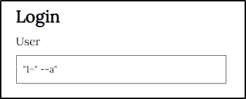

# Informe técnico: Talent ScoutTech

## Índice

1. [Parte 1 - SQLi](#1)  
2. [Parte 2 - XSS](#2)  
3. [Parte 3 - Control de acceso, autenticación y sesiones de usuarios](#3)  
4. [Parte 4 - Servidores web](#4)  
5. [Parte 5 - CSRF](#5)  

### Parte 1 - SQLi 

La página no permite añadir jugadores a usuarios no autenticados, un formulario nos exige que introduzcamos un usuario y contraseña válidos. Lo primero que haremos es comprobar que este formulario es vulnerable a una inyección y aprovecharlo para saltarnos esta protección.

**a) Dad un ejemplo de combinación de usuario y contraseña que provoque un error en la consulta SQL generada por este formulario. A partir del mensaje de error obtenido, decid cuál es la consulta SQL que se ejecuta, cuál de los campos introducidos al formulario utiliza y cuál no.**

Consulta realizada:

| Valor | “1=” --a” |
| --- | --- |
| Campo | User |
| Formulario | /insert_player.php |
| Consulta ejecutada | SELECT userId, password FROM users WHERE username = ""1=" --a"” |
| Campos del formulario web utilizados en la consulta SQL | Usuario |
| Campos del formulario web no utilizados en la consulta SQL | Contraseña |

**b) Gracias a la SQL Injection del apartado anterior, sabemos que este formulario es vulnerable y conocemos el nombre de los campos de la tabla “users”. Para tratar de impersonar a un usuario, nos hemos descargado un diccionario que contiene algunas de las contraseñas más utilizadas (se listan a continuación):**

- password
- 123456
- 12345678
- 1234
- qwerty
- 12345678
- dragon

**Dad un ataque que, utilizando este diccionario, nos permita impersonar un usuario de esta aplicación y acceder en nombre suyo. Tened en cuenta que no sabéis ni cuántos usuarios hay registrados en la aplicación, ni los nombres de estos.**

Se ha realizado un ataque con hydra con el diccionario proporcionado para las contraseñas y el diccionario rockyou.txt como usuarios.

El ataque realizado: 

`hydra -t 10 -w 30 -L /usr/share/wordlists/rockyou.txt -P /home/kali/Desktop/poss.txt 192.168.1.36 http-post-form "/insert_player.php:username=^USER^&password=^PASS^:Invalid user or password."` 

| Explicación del ataque | Este ataque consiste en la inyección de nombres de usuario y contraseñas en sus respectivos campos. hasta que encuentra la combinación correcta. |
| --- | --- |
| Campo de usuario con que el ataque ha tenido éxito | luis |
| Campo de contraseña con que el ataque ha tenido éxito | 1234 |

**c) Si vais a private/auth.php, veréis que en la función areUserAndPasswordValid”, se utiliza “SQLite3::escapeString()”, pero, aun así, el formulario es vulnerable a SQL Injections, explicad cuál es el error de programación de esta función y como lo podéis corregir.**

| Explicación del error | La función areUserAndPasswordValid() utiliza la interpolación de cadenas para construir la consulta SQL, lo que la hace vulnerable a inyecciones SQL. |
| --- | --- |
| Línea a solucionar | $query = $db->prepare('SELECT * FROM users WHERE username = :username AND password = :password');
 |
| Solución aplicable | $query = $db->prepare('SELECT * FROM users WHERE username = :username AND password = :password');
$query->bindValue(':username', $username, SQLITE3_TEXT);
$query->bindValue(':password', $password, SQLITE3_TEXT);
 |

**d) Si habéis tenido éxito con el *apartado b),* os habéis autenticado utilizando el usuario “luis” (si no habéis tenido éxito, podéis utilizar la contraseña “1234” para realizar este apartado). Con el objetivo de mejorar la imagen de la jugadora “Candela Pacheco”, le queremos escribir un buen puñado de comentarios positivos, pero no los queremos hacer todos con la misma cuenta de usuario.**

Para hacer esto, en primer lugar habéis hecho un ataque de fuerza bruta sobre el directorio del servidor web (por ejemplo, probando nombres de archivo) y habéis encontrado el archivo “add_comment.php~”. Estos archivos seguramente se han creado como copia de seguridad al modificar el archivo “.php” original directamente al servidor. En general, los servidores web no interpretan (ejecuten) los archivos “.php~” sino que los muestran como archivos de texto sin interpretar.

Esto nos permite estudiar el código fuente de “add_comment.php” y encontrar una vulnerabilidad para publicar mensajes en nombre de otros usuarios. ¿Cuál es esta vulnerabilidad, y cómo es el ataque que utilizáis para explotarla?

| Vulnerabilidad detectada | Falta de control de acceso que no valida si el usuario tiene permisos para agregar comentarios. |
| --- | --- |
| Descripción del ataque | El atacante envía una solicitud HTTP con un 'id' de jugador modificado y una cookie 'userId' falsificada, permitiendo publicar comentarios en nombre de otros usuarios. |
| ¿Cómo podemos hacer que sea segura esta entrada? | Implementar un control de acceso adecuado, validando la autenticación y permisos del usuario. Además, se deben validar y sanear los datos del usuario para prevenir inyecciones de código. |

### Parte 2 - XSS 

En vistas de los problemas de seguridad que habéis encontrado, empezáis a sospechar que esta aplicación quizás es vulnerable a XSS (Cross Site Scripting).

**a) Para ver si hay un problema de XSS, crearemos un comentario que muestre un alert de Javascript siempre que alguien consulte el/los comentarios de aquel jugador (show_comments.php). Dad un mensaje que genere un «alert» de Javascript al consultar el listado de mensajes.**

| Introduzca el mensaje |  |
| --- | --- |
| En el formulario de la página | show_comments.php |

**b) Por qué dice "&" cuando miráis un link(como el que aparece a la portada de esta aplicación pidiendo que realices un donativo) con parámetros GET dentro de código html si en realidad el link es sólo con "&" ?**

El símbolo "&" en el enlace de donación dentro del código HTML se utiliza como una entidad HTML (&amp;) en lugar del carácter "&" directamente. Esto se debe a que "&" es un carácter reservado en HTML y puede interpretarse incorrectamente por los navegadores si se utiliza directamente en el código fuente HTML.

**c) Explicad cuál es el problema de show_comments.php, y cómo lo arreglaríais. Para resolver este apartado, podéis mirar el código fuente de esta página.**

| ¿Cuál es el problema? | El problema es que la variable $_GET['id'] no está siendo filtrada adecuadamente, lo que puede permitir ataques de inyección de SQL. |
| --- | --- |
| Sustituyo el código de la/las líneas | $query = "SELECT commentId, username, body FROM comments C, users U WHERE C.playerId =" . $_GET['id'] . " AND U.userId = C.userId ORDER BY C.playerId DESC";
 |
| Por el siguiente código | $playerId = SQLite3::escapeString($_GET['id']);
$query = "SELECT commentId, username, body FROM comments C, users U WHERE C.playerId = '$playerId' AND U.userId = C.userId ORDER BY C.playerId DESC";
 |

d) Descubrid si hay alguna otra página que esté afectada por esta misma vulnerabilidad. En caso positivo, explicad cómo lo habéis descubierto.

| Otras páginas afectadas | insert_player.php |
| --- | --- |
| ¿Cómo lo he descubierto? | Haciendo una búsqueda de la variable problemática en el código de las páginas visitadas. |

### Parte 3 - Control de acceso, autenticación y sesiones de usuarios 

a) En el ejercicio 1, hemos visto cómo era inseguro el acceso de los usuarios a la aplicación. En la página de ***register.php*** tenemos el registro de usuario. ¿Qué medidas debemos implementar para evitar que el registro sea inseguro? Justifica esas medidas e implementa las medidas que sean factibles en este proyecto.

- **Validación de Entrada de Datos:** Es importante validar y limpiar los datos de entrada para evitar posibles ataques de inyección de código o SQL. Esto se puede lograr utilizando funciones como “filter_var()” para validar y “filter_input()” para limpiar los datos.

Se podría validar y limpiar los datos de entrada justo después de recibirlos del formulario, antes de usarlos en cualquier otra parte del código. 

`if (isset($_POST['username']) && isset($_POST['password'])) {
$username = htmlspecialchars($_POST['username']);
$password = htmlspecialchars($_POST['password']);`

- **Hashing de Contraseñas:** Nunca se debe almacenar contraseñas en texto plano en la base de datos. Debemos utilizar funciones de hashing seguras, como “password_hash()”, para almacenar las contraseñas de manera segura.

Después de recibir y limpiar los datos de entrada, deberías aplicar hashing a la contraseña antes de almacenarla en la base de datos.

`if (isset($_POST['username']) && isset($_POST['password'])) {
$username = htmlspecialchars($_POST['username']);
$password = htmlspecialchars($_POST['password']);
$hashed_password = password_hash($password, PASSWORD_DEFAULT);`

- **Consultas Preparadas:** Utilizar consultas preparadas o sentencias parametrizadas para interactuar con la base de datos. Esto previene eficazmente los ataques de inyección SQL al separar los datos de la consulta SQL, evitando así que los datos de entrada manipulen la estructura de la consulta.

Para evitar la inyección SQL, deberías utilizar consultas preparadas. Aquí es cómo podrías hacerlo para la inserción de datos del usuario:

`if (isset($_POST['username']) && isset($_POST['password'])) {
$username = htmlspecialchars($_POST['username']);
$password = htmlspecialchars($_POST['password']);
$query = $db->prepare("INSERT INTO users (username, password) VALUES (?, ?)");
$query->bindValue(1, $username, SQLITE3_TEXT);
$query->bindValue(2, $hashed_password, SQLITE3_TEXT);
$query->execute();`

- **Gestión de Errores Segura:** Cuando se producen errores durante el proceso de registro, es importante proporcionar mensajes de error claros y genéricos para evitar la divulgación de información sensible que pueda ser aprovechada por un atacante.

En PHP, el método **execute()** de un objeto de consulta devuelve **true** si la ejecución es exitosa y **false** si hay un error. 

`if (!$query->execute()) {
die("Error en el registro. Por favor, inténtelo de nuevo más tarde.");
}`

- **Seguridad en la Capa de Presentación:** Implementar medidas de seguridad en la capa de presentación, como la prevención de ataques XSS (Cross-Site Scripting), asegurándose de que no se pueda incrustar código malicioso en los campos de entrada del formulario.
    
    

b) En el apartado de login de la aplicación, también deberíamos implantar una serie de medidas para que sea seguro el acceso, (sin contar la del ejercicio 1.c). Como en el ejercicio anterior, justifica esas medidas e implementa las que sean factibles y necesarias (ten en cuenta las acciones realizadas en el register). Puedes mirar en la carpeta ***private***

- **Evitar la interpolación de cadenas en consultas SQL:** Al igual que en el ejercicio anterior, las consultas SQL deben construirse utilizando consultas preparadas para prevenir inyecciones SQL.

`$query = $db->prepare("SELECT * FROM users WHERE username = :username AND password = :password");
$query->bindValue(':username', $username, SQLITE3_TEXT);
$query->bindValue(':password', $password, SQLITE3_TEXT);`

- V**alidación de entrada de datos:** Se debe validar y sanitizar la entrada de datos para prevenir ataques de XSS (Cross-Site Scripting) y otros tipos de ataques.

`$name = filter_input(INPUT_POST, 'name', FILTER_SANITIZE_STRING);
$team = filter_input(INPUT_POST, 'team', FILTER_SANITIZE_STRING);`

- **Autenticación segura:** Se verifica la contraseña utilizando “password_verify()” en lugar de compararla directamente. Además, se consulta la base de datos utilizando una consulta preparada para prevenir inyecciones SQL.

`$password = $_POST['password'];
$query = $db->prepare("SELECT * FROM users WHERE username = :username");`

- **Protección contra ataques de fuerza bruta:** Podríamos agregar un mecanismo de bloqueo de cuentas después de varios intentos fallidos de inicio de sesión para mitigar ataques de fuerza bruta.

- **Protección de sesiones:** Implementar tokens de inicio de sesión seguros y renovar las sesiones periódicamente para evitar el secuestro de sesiones.

c) Volvemos a la página de ***register.php***, vemos que está accesible para cualquier usuario, registrado o sin registrar. Al ser una aplicación en la cual no debería dejar a los usuarios registrarse, qué medidas podríamos tomar para poder gestionarlo e implementa las medidas que sean factibles en este proyecto.

- **Verificar si el usuario está autenticado:** Verificar si el usuario ya está autenticado antes de mostrar el formulario de registro.

`require dirname(**FILE**) . '/private/auth.php';` 

- **Implementar roles de usuario:** Solo los administradores tendran acceso a la página de registro, mientras que los usuarios normales no.

- **Proteger la página con contraseña:** Se puede proteger la página de registro con una contraseña solo para personas autorizadas.

`$registration_password = "mi_contraseña_secreta";`

`if ($_SERVER["REQUEST_METHOD"] == "POST") {
if ($_POST['registration_password'] === $registration_password) {
} else {
echo "Contraseña incorrecta";
}
}`

d) Al comienzo de la práctica hemos supuesto que la carpeta ***private*** no tenemos acceso, pero realmente al configurar el sistema en nuestro equipo de forma local. ¿Se cumple esta condición? ¿Qué medidas podemos tomar para que esto no suceda?

- **Cambiar los permisos de la carpeta "private":** Revisar los permisos de la carpeta "private" para comprobar que estén bien configurados para que solo los usuarios autorizados tengan acceso a ella.
- **Mover archivos sensibles fuera de la carpeta "private":** Asegurarse de que los archivos estén almacenados en un lugar seguro donde no puedan ser accedidos directamente..
- **Utilizar variables de entorno o configuración externa:** En lugar de almacenar información sensible en archivos dentro de la carpeta "private", considera utilizar variables de entorno o archivos de configuración externos que puedan ser cargados de manera segura por tu aplicación.
- **Encriptar archivos sensibles:** Si no podemos guardar los archivos fuera de la carpeta “private”, se debería considerar encriptar estos archivos para agregar una capa adicional de seguridad.

e) Por último, comprobando el flujo de la sesión del usuario. Analiza si está bien asegurada la sesión del usuario y que no podemos suplantar a ningún usuario. Si no está bien asegurada, qué acciones podríamos realizar e implementarlas.

- **Autenticación segura:** Asegurarse de que el proceso de autenticación esté protegido contra ataques de fuerza bruta y manipulación de credenciales.
- **Gestión de sesiones segura:** Utilizar un mecanismo seguro para gestionar las sesiones de usuario, como cookies seguras y tokens de sesión únicos.
- **Verificación de sesiones activas:** Implementar un mecanismo para verificar si una sesión es activa y válida en cada solicitud de página protegida.

### Parte 4 - Servidores web 

¿Qué medidas de seguridad se implementaríais en el servidor web para reducir el riesgo a ataques?

- **Firewall:** Configura un firewall para filtrar el tráfico de red y bloquear intentos de acceso no autorizado.
- **Control de acceso:** Implementa autenticación y autorización para limitar el acceso solo a usuarios autorizados y privilegios mínimos necesarios.
- **Monitoreo y registro:** Establecer un sistema de monitoreo para supervisar la actividad del servidor y detectar posibles intrusiones o comportamientos extraños.
- **Parche de Actualización:** Mantener actualizados todo el software del servidor para corregir vulnerabilidades conocidas y mejorar la seguridad.
- **Restricción de ejecución de scripts:** Configurar el servidor para que solo permita la ejecución de scripts.

### Parte 5 - CSRF 

Ahora ya sabemos que podemos realizar un ataque XSS. Hemos preparado el siguiente enlace: [http://web.pagos/donate.php?amount=100&receiver=attacker,](http://web.pagos/donate.php?amount=100&receiver=attacker) mediante el cual, cualquiera que haga click hará una donación de 100€ a nuestro usuario (con nombre 'attacker') de la famosa plataforma de pagos online 'web.pagos' (Nota: como en realidad esta es una dirección inventada, vuestro navegador os devolverá un error 404).

a) Editad un jugador para conseguir que, en el listado de jugadores (list_players.php) aparezca, debajo del nombre de su equipo y antes de “(show/add comments)” un botón llamado “Profile” que corresponda a un formulario que envíe a cualquiera que haga clic sobre este botón a esta dirección que hemos preparado.

Podríamos agregar el siguiente código en cualquiera de los usuarios:
`<a href="[http://web.pagos/donate.php?amount=100&receiver=attacker](http://web.pagos/donate.php?amount=100&receiver=attacker)" target="_blank">Profile</a>`

| En el campo | Team name |
| --- | --- |
| Introduzco |  /br>/br>/br><a href="http://web.pagos/donate.php?amount=100&receiver=attacker" target="_blank">Profile</a> |

b) Una vez lo tenéis terminado, pensáis que la eficacia de este ataque aumentaría si no necesitara que el usuario pulse un botón. Con este objetivo, cread un comentario que sirva vuestros propósitos sin levantar ninguna sospecha entre los usuarios que consulten los comentarios sobre un jugador (show_comments.php).

Con el siguiente comando:
``

Se le ha añadido un comentario antes del script, así cuando se entre en la página cargada, se verá nuestro comentario, no un mensaje en blanco (antes de la redirección).

Cuando pulsamos en mostrar los comentarios de la persona a la que le hemos colocado el script, nos redirige automáticamente a la página deseada.

c) Pero 'web.pagos' sólo gestiona pagos y donaciones entre usuarios registrados, puesto que, evidentemente, le tiene que restar los 100€ a la cuenta de algún usuario para poder añadirlos a nuestra cuenta.

Explicad qué condición se tendrá que cumplir por que se efectúen las donaciones de los usuarios que visualicen el mensaje del apartado anterior o hagan click en el botón del apartado a).

- Que disponga de sesión en web.pagos.
- Fondos suficientes en la cuenta del usuario.
- Ejecución exitosa del script malicioso.

d) Si 'web.pagos' modifica la página 'donate.php' para que reciba los parámetros a través de POST, quedaría blindada contra este tipo de ataques? En caso negativo, preparad un mensaje que realice un ataque equivalente al de la apartado b) enviando los parámetros “amount” y “receiver” por POST.
